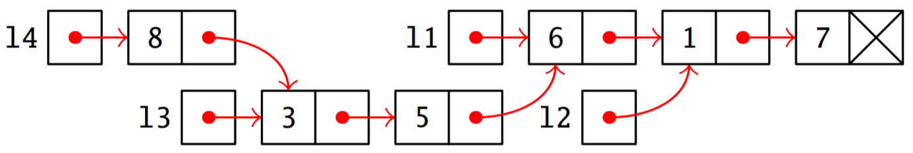

## Nom Prénom : 

## Programmation Orientée Objet :
### Exercice 1
On considère l'extrait de code ci-dessous :
```python
bart = Simpson("fils", 12)
homer = Simpson("père", 41)
homer.ronfle()
```
Compléter les phrases ci-dessous  :

1. ```bart``` est une ............................ de la ............................  ```Simpson```.
2. C'est donc un ........................... de type ........................... 
3. À la construction, l'........................... ```homer``` possède (au moins) deux ........................... qui valent ```"père"``` et ```41```.
Il possède aussi (au moins) une ........................... appelée ........................... .

### Exercice 2
On s'intéresse aux joueurs du Top14 de rugby.

1. Construire une classe ```Joueur``` où chaque instance contiendra les attributs ```nom```, ```club``` et ```age```.  
```python
class Joueur :

    
    


```

2. Instancier le joueur Nans_DUCUING, joueur de 27 ans évoluant à l'UBB.
```python


```

3. Écrire une fonction prenant en paramètres deux joueurs de la classe ```Joueur``` et renvoyant le nom du joueur le plus âgé, ou celui des deux joueurs dans le cas d'une égalité d'âge.
```python
def compare(joueur1, joueur2) :


    

    

```
## Programmation récursive :
### Exercice 1 :

On considère la fonction`mystere(n)` définit par le code :
```python
def mystere(n):
	if n == 0:
		return 1
	else:
		return n * mystere(n-1)
```
1. Quel est le résultat renvoyé par `mystere(4)` ? .......................................................

1. Décrire, en français, ce que fait cette fonction :
	...........................................................................................................................................................
	...........................................................................................................................................................
	...........................................................................................................................................................
	
   
   
1. Proposer une version itérative documentée pour cette fonction :
```python
def mystere(n :    ) ->     :
	'''
	
	
	
	
	'''
	
	
	
	
	
	
	return 
```
### Exercice 2 :

On considère la fonction`sigma(n)` définit par le code :
```python
def sigma(n):
	resultat = 0
	for i in range(n+1) :
		resultat = resultat + i
	return resultat
```
1. Quel est le résultat renvoyé par `sigma(0)` ? .......................................................

1. Quel est le résultat renvoyé par `sigma(4)` ? .......................................................

1. Décrire, en français, ce que fait cette fonction :
	...........................................................................................................................................................
	...........................................................................................................................................................
	...........................................................................................................................................................
	
	
	
1. Proposer une version récursive documentée pour cette fonction :
```python
def sigma(n :    ) ->     :
	'''
	
	
	
	
	'''
	
	
	
	
	
	
	 
```
## Listes chainées :

On considère des listes chaînées, avec la liste vide notée `nil` et les fonctions suivantes :

| Fonction | Description |
|:-:|:-:|
| `tete(liste)` | Renvoie la valeur du premier maillon de `liste`, qui ne doit pas être vide. |
| `queue(liste)` | Renvoie la liste sur laquelle pointe le premier maillon de `liste`, qui ne doit pas être vide. |
| `cons(valeur, liste)` | Renvoie une nouvelle liste correspondant à l’ajout de `valeur` en début de `liste`. |
| `est_vide(liste)` | Renvoie un booléen indiquant si `liste` est vide ou non. |

Le schéma suivant correspond à la représentation en mémoire des listes chaînées `l1`, `l2`, `l3` et `l4`.



### Exercice 1 :
Pour chacune des commandes suivantes, indiquer la réponse obtenue.

1. `tete(l2)` :  ...........................
1. `queue(l1)`:  ...........................
1. `est_vide(queue(l1))`:  ...........................
1. `tete(queue(queue(queue(l4))))`:  ...........................
1. `est_vide(queue(queue(l2)))`:  ...........................

### Exercice 2 :
L'instruction `l1 = cons(6, cons(1, cons(7, nil)))` définit la liste `l1`.
Donner les définitions des listes `l2`, `l3` et `l4` à l’aide des fonctions `cons` et `queue` et en réutilisant les listes déjà définies pour définir les suivantes :
1. `l2` = ...............................................................................................................
2. `l3` = ...............................................................................................................
3. `l4` = ...............................................................................................................

### Exercice 3 :
En utilisant les fonctions données ci-dessus,  proposer une version itérative et une version récursive pour la fonction `longueur(liste)` qui renvoie la longueur de la liste chaînée `liste` telle que :
```python
>>> longueur(nil)
0
>>> longueur(cons(7, cons(0, cons(12, nil))))
3
```
```python
def longueur(liste) : # version itérative


    
    
    
    


```
```python
def longueur(liste) : # version récursive


    
    
    
    


```


