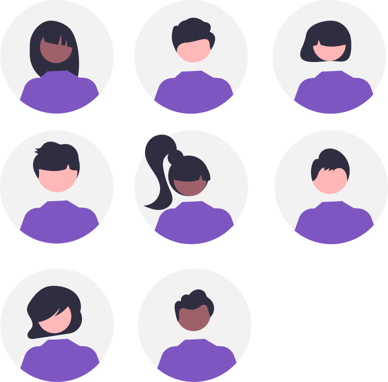

## Avertissement :

[{: align=left width=10%}](){target=_blank}[{: align=right width=10%}](mailto:team-1nsi-20222023@ecmorlaix.fr){target=_blank}Ce site s'adresse au groupe des élèves de première du lycée Notre Dame du Mur qui suivent l'enseignement de spécialité Numérique et Sciences Informatiques.
<!-- 
### Autres liens du groupe :

- [Sharepoint](https://ecmorlaix.sharepoint.com/sites/TEAM-1NSI-20212022/Documents%20partages/Forms/AllItems.aspx?CT=1633088990185&RootFolder=%2Fsites%2FTEAM%2D1NSI%2D20212022%2FDocuments%20partages%2FGeneral&FolderCTID=0x012000019689D1FEC0FB4E86F4D05CA2B5A0EC){target=_blank}
- [Conversation](https://outlook.office365.com/mail/group/ecmorlaix.fr/team-tnsi-20222023/email){target=_blank} -->

***

{: .center width=50%}

[mail]: mailto:eric.madec@ecmorlaix.fr "eric.madec@ecmorlaix.fr"

<!-- ***
Synthèse Pile et File le 08/11 puis SQL puis récursivité avec dessin pour Noël... -->

## Le 18/11 :

=== "CONTENU DE SÉANCE"

    - Evaluation pratique appliquées aux [tours de Hanoï partie A](https://nbviewer.org/urls/ericecmorlaix.github.io/TNSI_2022-2023/SD/ds2-Partie_Pratique_A.ipynb){target=_blank}  [:fontawesome-solid-download:](https://ericecmorlaix.github.io/TNSI_2022-2023/SD/ds2-Partie_Pratique_A.ipynb){ .md-button .md-button--primary} ;
    - Evaluation pratique : [une tortue récursive](https://nbviewer.org/urls/ericecmorlaix.github.io/TNSI_2022-2023/LP/Une_tortue_recursive.ipynb){target=_blank}  [:fontawesome-solid-download:](https://ericecmorlaix.github.io/TNSI_2022-2023/LP/Une_tortue_recursive.ipynb){ .md-button .md-button--primary} ;

=== "TRAVAIL À FAIRE"

    - Reprise en main d'[ipycanvas](https://nbviewer.org/urls/ericecmorlaix.github.io/TNSI_2022-2023/ipycanvas-Le_BN_pour_dessiner.ipynb){target=_blank}  [:fontawesome-solid-download:](https://ericecmorlaix.github.io/TNSI_2022-2023/ipycanvas-Le_BN_pour_dessiner.ipynb){ .md-button .md-button--primary} ;
    - **Rendre** progressivement par [mail] le travail réalisé sur les notebook [Récursif](https://nbviewer.org/urls/ericecmorlaix.github.io/TNSI_2022-2023/LP/Recursif.ipynb){target=_blank}, [Pile](https://nbviewer.org/urls/ericecmorlaix.github.io/TNSI_2022-2023/SD/Structure_Lineaire-Pile.ipynb){target=_blank}, [File](https://nbviewer.org/urls/ericecmorlaix.github.io/TNSI_2022-2023/SD/Structure_Lineaire-File.ipynb){target=_blank}...

***
## Le 17/11

=== "CONTENU DE SÉANCE"

    - Evaluation sur la programmation récursive, les structures de donnée Piles et Files et la programmation en Python plus généralement ;

=== "TRAVAIL À FAIRE"
    
    - **Rendre** progressivement par [mail] le travail réalisé sur les notebook [Récursif](https://nbviewer.org/urls/ericecmorlaix.github.io/TNSI_2022-2023/LP/Recursif.ipynb){target=_blank}, [Pile](https://nbviewer.org/urls/ericecmorlaix.github.io/TNSI_2022-2023/SD/Structure_Lineaire-Pile.ipynb){target=_blank}, [File](https://nbviewer.org/urls/ericecmorlaix.github.io/TNSI_2022-2023/SD/Structure_Lineaire-File.ipynb){target=_blank}...
    

***
## Le 15/11

=== "CONTENU DE SÉANCE"

    - **Finir** la [programmation récursive](https://nbviewer.org/urls/ericecmorlaix.github.io/TNSI_2022-2023/LP/Recursif.ipynb){target=_blank}  [:fontawesome-solid-download:](https://ericecmorlaix.github.io/TNSI_2022-2023/LP/Recursif.ipynb){ .md-button .md-button--primary} ;
    - **Analyser** la proposition de correction du notebook [Liste](https://nbviewer.org/urls/ericecmorlaix.github.io/TNSI_2022-2023/SD/Structure_Lineaire-Liste-Complet.ipynb){target=_blank}  [:fontawesome-solid-download:](https://ericecmorlaix.github.io/TNSI_2022-2023/SD/Structure_Lineaire-Liste-Complet.ipynb){ .md-button .md-button--primary} ;    
    - **Lire** la [proposition de correction](./SD/Corrections-Evaluation_POO-DM_Liste) de l'évaluation de POO et **Compléter** celle sur les listes chainées ;
    - **Lire** la [correction](./SD/Correction-DM_Pile_File.pdf) du DM sur les Piles et Files ;
    - Synthèse [programmation récursive](https://glassus.github.io/terminale_nsi/T2_Programmation/2.2_Recursivite/cours/){target=_blank} et [structure linéaire Liste, Pile et File](https://glassus.github.io/terminale_nsi/T1_Structures_de_donnees/1.1_Listes_Piles_Files/cours/){target=_blank} ;

=== "TRAVAIL À FAIRE"
    
    - **Rendre** progressivement par [mail] le travail réalisé sur les notebook [Récursif](https://nbviewer.org/urls/ericecmorlaix.github.io/TNSI_2022-2023/LP/Recursif.ipynb){target=_blank}, [Pile](https://nbviewer.org/urls/ericecmorlaix.github.io/TNSI_2022-2023/SD/Structure_Lineaire-Pile.ipynb){target=_blank}, [File](https://nbviewer.org/urls/ericecmorlaix.github.io/TNSI_2022-2023/SD/Structure_Lineaire-File.ipynb){target=_blank}...
    - **Se préparer** pour une évaluation sur la programmation récursive, les structures de donnée Piles et Files et la programmation en Python plus généralement pour le 17/11.

***
## Le 10/11

=== "CONTENU DE SÉANCE"

    - **Découvrir** la [programmation récursive](https://nbviewer.org/urls/ericecmorlaix.github.io/TNSI_2022-2023/LP/Recursif.ipynb){target=_blank}  [:fontawesome-solid-download:](https://ericecmorlaix.github.io/TNSI_2022-2023/LP/Recursif.ipynb){ .md-button .md-button--primary} ;

=== "TRAVAIL À FAIRE"
    
    - **Rendre** progressivement par [mail] le travail réalisé sur les notebook [Récursif](https://nbviewer.org/urls/ericecmorlaix.github.io/TNSI_2022-2023/LP/Recursif.ipynb){target=_blank}, [Pile](https://nbviewer.org/urls/ericecmorlaix.github.io/TNSI_2022-2023/SD/Structure_Lineaire-Pile.ipynb){target=_blank}, [File](https://nbviewer.org/urls/ericecmorlaix.github.io/TNSI_2022-2023/SD/Structure_Lineaire-File.ipynb){target=_blank}...

***
## Les 20 et 21/10 (2h + 1h)

=== "CONTENU DE SÉANCE"

    - Synthèse de [Liste](https://nbviewer.org/urls/ericecmorlaix.github.io/TNSI_2022-2023/SD/Lucien_Structure_Lineaire-Liste.ipynb){target=_blank}  [:fontawesome-solid-download:](https://ericecmorlaix.github.io/TNSI_2022-2023/SD/Lucien_Structure_Lineaire-Liste.ipynb){ .md-button .md-button--primary} ;
    
    - [Evaluation sur la POO et les listes chainées](./SD/Eval_POO_Liste.pdf){target=_blank}  le 20/10.
    
    - Structure Linéaire de Données :
        - [Pile](https://nbviewer.org/urls/ericecmorlaix.github.io/TNSI_2022-2023/SD/Structure_Lineaire-Pile.ipynb){target=_blank}  [:fontawesome-solid-download:](https://ericecmorlaix.github.io/TNSI_2022-2023/SD/Structure_Lineaire-Pile.ipynb){ .md-button .md-button--primary} ;
        - [File](https://nbviewer.org/urls/ericecmorlaix.github.io/TNSI_2022-2023/SD/Structure_Lineaire-File.ipynb){target=_blank}  [:fontawesome-solid-download:](https://ericecmorlaix.github.io/TNSI_2022-2023/SD/Structure_Lineaire-File.ipynb){ .md-button .md-button--primary} ;

=== "TRAVAIL À FAIRE"
    
    - **Rendre** progressivement par [mail] le travail réalisé sur les notebook [Pile](https://nbviewer.org/urls/ericecmorlaix.github.io/TNSI_2022-2023/SD/Structure_Lineaire-Pile.ipynb){target=_blank}, [File](https://nbviewer.org/urls/ericecmorlaix.github.io/TNSI_2022-2023/SD/Structure_Lineaire-File.ipynb){target=_blank}...

    - **Faire** sur copie le Devoir Maison [DM_Pile_File.pdf](./SD/DM_Pile_File.pdf){target=_blank} pour le 07/11 ;

***
## Du 11 au 18/10

=== "CONTENU DE SÉANCE"

    - [Synthèse de Programmation Orientée Objet](https://nbviewer.org/urls/ericecmorlaix.github.io/TNSI_2022-2023/SD/POO-SyntheseProgrammationOrienteeObjet.ipynb){target=_blank} [:fontawesome-solid-download:](https://ericecmorlaix.github.io/TNSI_2022-2023/SD/POO-SyntheseProgrammationOrienteeObjet.ipynb){ .md-button .md-button--primary};

    - Structure Linéaire de Données :
        - [Liste](https://nbviewer.org/urls/ericecmorlaix.github.io/TNSI_2022-2023/SD/Structure_Lineaire-Liste.ipynb){target=_blank}  [:fontawesome-solid-download:](https://ericecmorlaix.github.io/TNSI_2022-2023/SD/Structure_Lineaire-Liste.ipynb){ .md-button .md-button--primary} ;
        - [Pile](https://nbviewer.org/urls/ericecmorlaix.github.io/TNSI_2022-2023/SD/Structure_Lineaire-Pile.ipynb){target=_blank}  [:fontawesome-solid-download:](https://ericecmorlaix.github.io/TNSI_2022-2023/SD/Structure_Lineaire-Pile.ipynb){ .md-button .md-button--primary} ;
        - [File](https://nbviewer.org/urls/ericecmorlaix.github.io/TNSI_2022-2023/SD/Structure_Lineaire-File.ipynb){target=_blank}  [:fontawesome-solid-download:](https://ericecmorlaix.github.io/TNSI_2022-2023/SD/Structure_Lineaire-File.ipynb){ .md-button .md-button--primary} ;

=== "TRAVAIL À FAIRE"

    - **Se préparer** pour une évaluation sur la POO, les listes chainées et la programmation impérative et procédurale en Python plus généralement pour le 20/10.
    - **Rendre** progressivement par [mail] le travail réalisé sur les notebook [POO](https://nbviewer.org/urls/ericecmorlaix.github.io/TNSI_2022-2023/SD/POO-SyntheseProgrammationOrienteeObjet.ipynb), [Liste](https://nbviewer.org/urls/ericecmorlaix.github.io/TNSI_2022-2023/SD/Structure_Lineaire-Liste.ipynb){target=_blank}, [Pile](https://nbviewer.org/urls/ericecmorlaix.github.io/TNSI_2022-2023/SD/Structure_Lineaire-Pile.ipynb){target=_blank}, [File](https://nbviewer.org/urls/ericecmorlaix.github.io/TNSI_2022-2023/SD/Structure_Lineaire-File.ipynb){target=_blank}...

***
## Le 06/10 (2h)

=== "CONTENU DE SÉANCE"

    - Propositions de correction pour l'exercice [Série de notes](https://nbviewer.org/urls/ericecmorlaix.github.io/TNSI_2022-2023/LP/Proposition_Exercice_Notes_Complet.ipynb) en programmation impérative et procédurale avec gestion des erreurs ->==Faire le travail de modularisation démandé== [:fontawesome-solid-download:](https://ericecmorlaix.github.io/TNSI_2022-2023/LP/Proposition_Exercice_Notes_Complet.ipynb){ .md-button .md-button--primary}; 

    - **Finir** les activités d'introduction à la [Programmation Orientée Objet](https://nbviewer.org/urls/ericecmorlaix.github.io/TNSI_2022-2023/SD/POO-IntroductionProgrammationOrienteeObjet.ipynb){target=_blank} et transmettre ce notebook par mail ;​​   

    - **Appliquer** la POO à la programmation de vos projets pour la Fête de la Science ;

=== "TRAVAIL À FAIRE"

    - **Finir** les activités d'introduction à la [Programmation Orientée Objet](https://nbviewer.org/urls/ericecmorlaix.github.io/TNSI_2022-2023/SD/POO-IntroductionProgrammationOrienteeObjet.ipynb){target=_blank} et transmettre ce notebook par mail ;   

***
## Le 04/10 (1h)

=== "CONTENU DE SÉANCE"

    - Info du [bac](./bac) ;

    - Retour sur le travail demandé (quid de la modularité ?)  ;    

    - **Poursuivre** l'introduction à la [Programmation Orientée Objet](https://nbviewer.org/urls/ericecmorlaix.github.io/TNSI_2022-2023//SD/POO-IntroductionProgrammationOrienteeObjet.ipynb){target=_blank} [:fontawesome-solid-download:](https://ericecmorlaix.github.io/TNSI_2022-2023/SD/POO-IntroductionProgrammationOrienteeObjet.ipynb){ .md-button .md-button--primary} ;

=== "TRAVAIL À FAIRE"

    - **Finir** le notebook des [recommandations de programmation appliquées à l'exercice série de notes](https://nbviewer.org/urls/ericecmorlaix.github.io/TNSI_2022-2023/LP/Recommandations_de_programmation-Exercice_notes.ipynb){target=_blank} et le **rendre** par [mail] pour le 29/09 ;

    - **Finir** l'introduction à la [Programmation Orientée Objet](https://nbviewer.org/urls/ericecmorlaix.github.io/TNSI_2022-2023//SD/POO-IntroductionProgrammationOrienteeObjet.ipynb){target=_blank} [:fontawesome-solid-download:](https://ericecmorlaix.github.io/TNSI_2022-2023/SD/POO-IntroductionProgrammationOrienteeObjet.ipynb){ .md-button .md-button--primary} ;

## Le 29/09 (2h)

=== "CONTENU DE SÉANCE"

    - **Finir** le notebook des [recommandations de programmation appliquées à l'exercice série de notes](https://nbviewer.org/urls/ericecmorlaix.github.io/TNSI_2022-2023/LP/Recommandations_de_programmation-Exercice_notes.ipynb){target=_blank} et le **rendre** par [mail] pour le 29/09 ;

    - Introduction à la [Programmation Orientée Objet](https://nbviewer.org/urls/ericecmorlaix.github.io/TNSI_2022-2023//SD/POO-IntroductionProgrammationOrienteeObjet.ipynb){target=_blank} [:fontawesome-solid-download:](https://ericecmorlaix.github.io/TNSI_2022-2023/SD/POO-IntroductionProgrammationOrienteeObjet.ipynb){ .md-button .md-button--primary} ;

=== "TRAVAIL À FAIRE"

    - **Finir** le notebook des [recommandations de programmation appliquées à l'exercice série de notes](https://nbviewer.org/urls/ericecmorlaix.github.io/TNSI_2022-2023/LP/Recommandations_de_programmation-Exercice_notes.ipynb){target=_blank} et le **rendre** par [mail] pour le 29/09 ;

    - **Poursuivre** l'introduction à la [Programmation Orientée Objet](./SD/POO-IntroductionProgrammationOrienteeObjet.ipynb) ;

***
## Le 27/09 (1h)

=== "CONTENU DE SÉANCE"

    - Retour sur le travail demandé ;

    - [Recommandations de programmation appliquées à l'exercice série de notes](https://nbviewer.org/urls/ericecmorlaix.github.io/TNSI_2022-2023/LP/Recommandations_de_programmation-Exercice_notes.ipynb){target=_blank} [:fontawesome-solid-download:](https://ericecmorlaix.github.io/TNSI_2022-2023/LP/Recommandations_de_programmation-Exercice_notes.ipynb){ .md-button .md-button--primary} -> ==**expérimenter** les solutions du notebook en complétant le code et la documentation des fonctions partiellement données==

=== "TRAVAIL À FAIRE"

    - **Finir** le notebook des [recommandations de programmation appliquées à l'exercice série de notes](https://nbviewer.org/urls/ericecmorlaix.github.io/TNSI_2022-2023/LP/Recommandations_de_programmation-Exercice_notes.ipynb){target=_blank} et le **rendre** par [mail] pour le 29/09 ;

***
## Le 22/09 : (2h)

=== "CONTENU DE SÉANCE"

    - [Notion de paradigme de programmation](https://nbviewer.org/urls/ericecmorlaix.github.io/TNSI_2022-2023/LP/Notion_de_Paradigmes-Introduction.ipynb){target=_blank} [:fontawesome-solid-download:](https://ericecmorlaix.github.io/TNSI_2022-2023/LP/Notion_de_Paradigmes-Introduction.ipynb){ .md-button .md-button--primary} -> ==**regarder** rapidement le début de la vidéo et **faire** les activités de révisions associées==

=== "TRAVAIL À FAIRE"

    - **Finir** les activités de révisions associées à la [Notion de paradigme de programmation impérative structurée et procédurale en Python](https://nbviewer.org/urls/ericecmorlaix.github.io/TNSI_2022-2023/LP/Notion_de_Paradigmes-Introduction.ipynb#Exercice-:-S%C3%A9rie-de-notes){target=_blank} et les **remettre** par [mail] pour le 27/09 ;

***
## Les 13, 15 et 20/09 : (1h + 2h + 1h)

- **Finir** le notebook synthèse de révisions de programmation en Python avec l'application en ligne [futurcoder](https://fr.futurecoder.io/course/#IntroducingTheShell){:target="_blank"} et le transmettre par [mail] pour support d'une restitution orale -> ==**Se préparer** pour accompagner un groupe d'élèves de Secondes avec cet outil le mardi 20/09 de 10h à 12h== ; 

***
## Les 06 et 08/09 : (1h + 2h)

- Redécouvrir les bases de la programmation en Python avec l'application en ligne [futurcoder](https://fr.futurecoder.io/course/#IntroducingTheShell){:target="_blank"} -> ==**Se préparer** pour accompagner un groupe d'élèves de Secondes avec cet outil...== ;

- Organiser [un classeur numérique pour la NSI sur GitHub](./github) -> ==**Rédiger** progressivement un notebook jupyter résumant vos apprentissages algorithmiques et leur programmation en Python3...== ;

